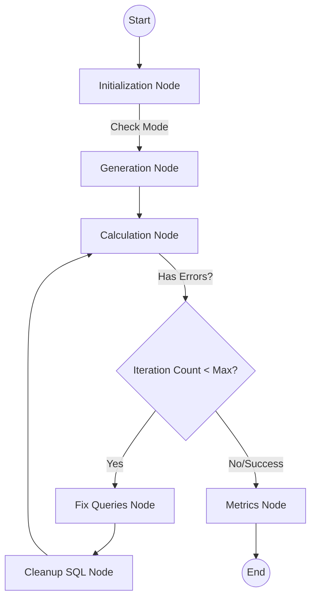

# System Architecture: Active Learning Pipeline

This document describes the architectural design and data flow of the Active Learning pipeline.

## 🔄 Core Workflow (LanGraph)

The system uses a directed graph to orchestrate the movement of queries from generation to evaluation.

### Node Descriptions

1.  **Initialization Node**: Loads environment variables and checks if the system should run a new generation or load existing queries.
2.  **Generation Node**: Batches requests to Ollama. It uses `Column Statistics` and `Previous Queries` to ensure realism and diversity.
3.  **Calculation Node**: Connects to Postgres via `db_utils.py` to execute `EXPLAIN` (for estimates) and `SELECT COUNT(*)` (for actual counts).
4.  **Fix Queries Node**: A self-healing node that uses regex-based heuristics for common errors (e.g., hallucinated columns) and falls back to an LLM-based fix.
5.  **Metrics Node**: Computes final statistics, including SQL complexity scores and KL Divergence between estimated and actual selectivity.

### 📊 Analysis & Evaluation
Independent from the main pipeline, the evaluation module (`metrics/compare_workloads.py`) provides post-hoc analysis:
- **Structural Comparison**: Compares distribution of Joins, Tables, and Complexity Scores against real workloads (e.g., Job-Light).
- **Statistical Tests**: Uses Kolmogorov-Smirnov (KS) tests and Wasserstein Distance to quantify similarity.
- **Robustness**: Designed to degrade gracefully; if DB connection fails, it skips execution metrics (Cardinality/Q-Error) but still computes structural metrics.

---

## 💾 Data Persistence & I/O

The pipeline is optimized for handling thousands of queries through an **"In-Memory Accumulation, Batch Write"** strategy.

### Persistent Format
- **JSONL**: Intermediate batches are saved as `.jsonl` (line-delimited JSON) for crash resilience.
- **JSON**: Final outputs are consolidated into a single standard JSON array.

### I/O Optimization
Previously, the system wrote to disk after every query (O(N²) complexity). The current implementation performs updates in memory and executes a single atomic write at the end of each batch node (O(N) complexity), dramatically improving speed for large datasets.

---

## 🛠️ Shared Components

### db\_utils.py
Centralizes all database interactions.
- **Connection Pooling**: (Planned/Standardized)
- **Stats Loader**: Provides the `STATS` context for the LLM.
- **Row Counter**: Precision-wrapped query execution with timeouts.

### fix\_queries.py
Generalized logic to fix SQL hallucinations across different datasets.
- **SQLGlot**: Uses SQLGlot for structural normalization and qualifying ambiguous column names.
- **LLM Fallback**: Uses a high-temperature "Fix Prompt" for complex syntax errors.
